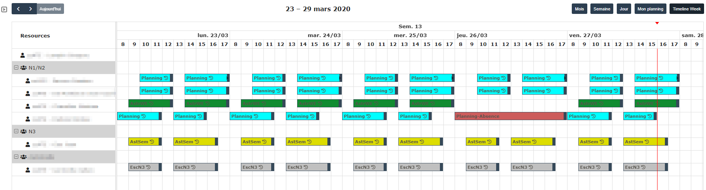

# advancedplanning GLPI plugin

This plugin unlock advanced planning features (scheduler view) in GLPI (Home > Assistance > Planning).

Glpi uses [Fullcalendar lib](fullcalendar.io/) to display its planning.
The [scheduler part](https://fullcalendar.io/license/premium) is triple licenced, the GLPI case is supported by the option 3 : open source.
As the option 3 is released under GLPV3, we can't use it directly in GLPI as it's incompatible with our licence (GPLv2+).

So this plugin just include the lib and add the option `schedulerLicenseKey: 'GPL-My-Project-Is-Open-Source'` to avoid licence incompatibility.

## Contributing

* Open a ticket for each bug/feature so it can be discussed
* Follow [development guidelines](http://glpi-developer-documentation.readthedocs.io/en/latest/plugins/index.html)
* Refer to [GitFlow](http://git-flow.readthedocs.io/) process for branching
* Work on a new branch on your own fork
* Open a PR that will be reviewed by a developer
