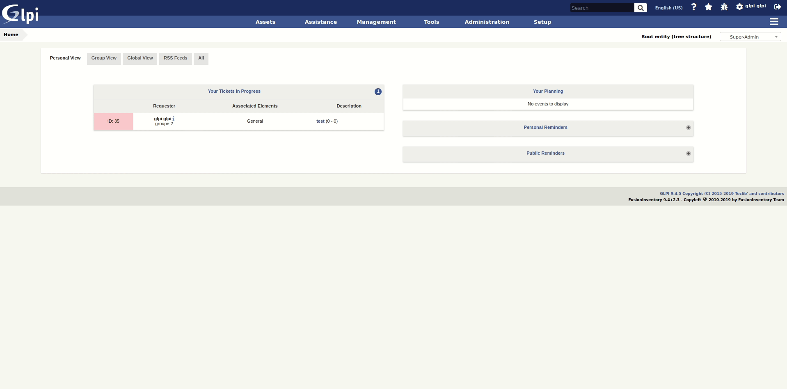

# Credit vouchers GLPI plugin

This plugin allows you to declare and follow (by entity) the consumptions of different credit vouchers
directly from the Ticket form.

To do it, you must follow these steps:

* Creation of different types of credit vouchers (as GLPI dropdown);
* Creation, in **Entity** tab, of the credit vouchers available for these entities;
* Declaration / Modification / Deletion of a consumption in the **Ticket** form and tab;
* Consultation of the vouchers sold, the remaining credits, credits consumptions from the **Ticket** form or from **Entity** tab.

## Documentation

We maintain a detailed documentation here -> [Documentation](https://glpi-plugins.readthedocs.io/en/latest/credit/index.html)

## Contact

For notices about major changes and general discussion of credit, subscribe to the [/r/glpi](https://www.reddit.com/r/glpi/) subreddit.
You can also chat with us via IRC in [#glpi on freenode](http://webchat.freenode.net/?channels=glpi) or [@glpi on Telegram](https://t.me/glpien).

## Professional Services

The GLPI Network services are available through our [Partner's Network](http://www.teclib-edition.com/en/partners/). We provide special training, bug fixes with editor subscription, contributions for new features, and more.

Obtain a personalized service experience, associated with benefits and opportunities.

## Contributing

* Open a ticket for each bug/feature so it can be discussed
* Follow [development guidelines](http://glpi-developer-documentation.readthedocs.io/en/latest/plugins/index.html)
* Refer to [GitFlow](http://git-flow.readthedocs.io/) process for branching
* Work on a new branch on your own fork
* Open a PR that will be reviewed by a developer

## Copying

* **Code**: you can redistribute it and/or modify
    it under the terms of the GNU General Public License ([GPL-2.0](https://www.gnu.org/licenses/gpl-2.0.en.html)).
