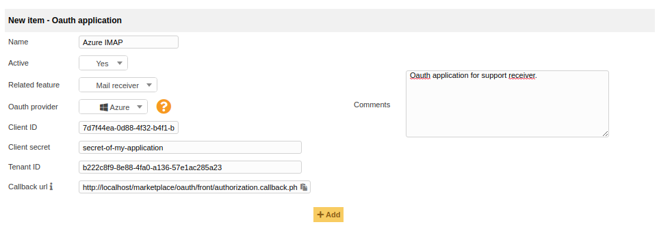
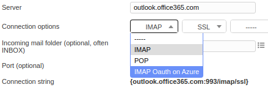

# Oauth IMAP client for GLPI

This plugins provides IMAP SASL XOAUTH2 authentication mechanism for mail receivers.

Currently implemented for:

 * [Google (G Suite and Gmail)](https://developers.google.com/gmail/imap/xoauth2-protocol)
 * [Microsoft (Office 365 via Azure AD)](https://docs.microsoft.com/en-us/exchange/client-developer/legacy-protocols/how-to-authenticate-an-imap-pop-smtp-application-by-using-oauth)

## Documentation

We maintain a detailed documentation here -> [Documentation](https://glpi-plugins.readthedocs.io/en/latest/oauthimap/index.html)

## Professional Services

The GLPI Network services are available through our [Partner's Network](http://www.teclib-edition.com/en/partners/). We provide special training, bug fixes with editor subscription, contributions for new features, and more.

Obtain a personalized service experience, associated with benefits and opportunities.

## Copying

* **Code**: you can redistribute it and/or modify
    it under the terms of the GNU General Public License ([GPL-2.0](https://www.gnu.org/licenses/gpl-2.0.en.html)).
