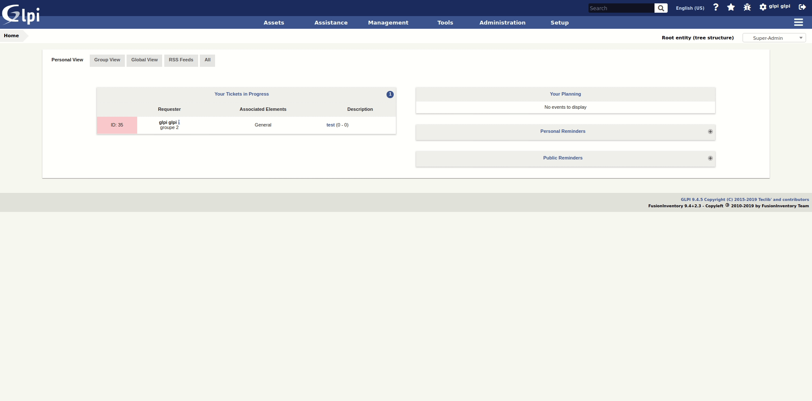

# Tag GLPI plugin

* Add tags on every GLPI item type (which extends `CommonDBTM`)
* Manage tag from labels
* Tags are displayed and editable in the object form header (just below title)
* You can search for tags and display them in objects lists
* You can display a report from associated objects in administration

* Download : https://github.com/PluginsGLPI/tag/releases

## Documentation

We maintain a detailed documentation here -> [Documentation](https://glpi-plugins.readthedocs.io/en/latest/tag/index.html)

## Contact

For notices about major changes and general discussion of tag, subscribe to the [/r/glpi](https://www.reddit.com/r/glpi/) subreddit.
You can also chat with us via IRC in [#glpi on freenode](http://webchat.freenode.net/?channels=glpi) or [@glpi on Telegram](https://t.me/glpien).

## Professional Services

The GLPI Network services are available through our [Partner's Network](http://www.teclib-edition.com/en/partners/). We provide special training, bug fixes with editor subscription, contributions for new features, and more.

Obtain a personalized service experience, associated with benefits and opportunities.

## Contributing

* Open a ticket for each bug/feature so it can be discussed
* Follow [development guidelines](http://glpi-developer-documentation.readthedocs.io/en/latest/plugins/index.html)
* Refer to [GitFlow](http://git-flow.readthedocs.io/) process for branching
* Work on a new branch on your own fork
* Open a PR that will be reviewed by a developer

## Copying

* **Code**: you can redistribute it and/or modify
    it under the terms of the GNU General Public License ([GPL-2.0](https://www.gnu.org/licenses/gpl-2.0.en.html)).

